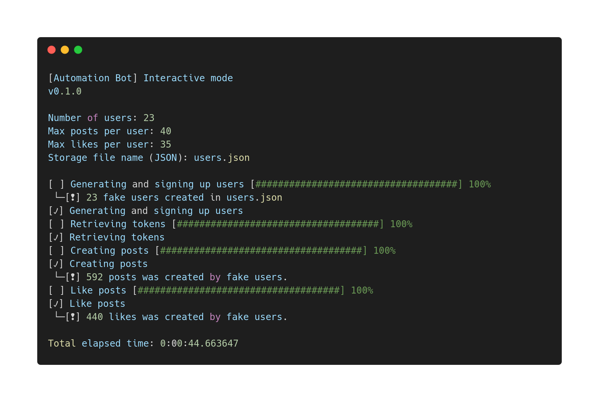

# Automation bot

CLI tool for `drf-react-social` project testing purposes.



## Table of Contents
- [Installation](#installation)
- [Usage](#usage)
    - [Parameters](#parameters)
    - [Configuration file template](#configuration-file-template)
    - [CLI](#parameters)
- [Release History](#release-history)

## Installation

> Automation bot requires running `docker-compose` containers with `drf-react-social`. See `README.md` in project root!

Clone repository to your local machine:

    git clone https://github.com/Hephest/drf-react-social.git
    
Move to `bot/` directory:

    cd drf-react-social/bot/
    
Create virtual environment and install required packages from `requirements.txt`:

    python -m venv bot_venv/
    source bot_venv/bin/activate
    pip install -r requirements.txt
    
Run automation bot:

    python bot.py
    
## Usage

### Parameters

| Parameter | Type | Description |
| --------- | ---- | ----------- |
| `number_of_users` | `int` | Number of users, which needed to be created and signed up by bot |
| `max_posts_per_user` | `int` | Number of posts, which could be created by single user
| `max_likes_per_user` | `int` | Number of posts, which could be liked by user 
| `filename` | `str` | Path to JSON file, where fake users data is stored |

### Configuration file template

> `config.ini` required only in **manual mode**

```ini
[constants]
number_of_users = 20
max_posts_per_user = 35
max_likes_per_user = 40

[storage]
filename = users.json
```

### CLI

Automation bot provides 2 ways to work with:

1. **Manual mode**

    Manual mode requires `config.ini`, created in automation bot script
    root (`bot/`) with needed parameters (see [Parameters](#parameters) section)
       
2. **Interactive mode**

    Interactive mode provide user-friendly command-line interface for user input.
    
## Release History

- 0.1.0
    - First release